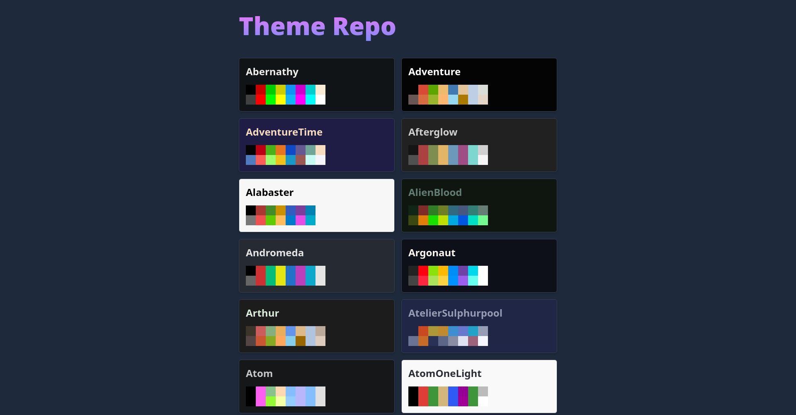

# Theme Repo



Theme Repo is a self-hosted repository to store your color schemes.
With Theme Repo, you can store, manage, and keep track of your color schemes.
Themes can be converted to custom formats for use with any external application.

## Features

- Independent API
- Custom scheme formats
- (Optional) web frontend

## Getting Started

### Docker Compose

1. Create `docker-compose.yml` file:

```yaml
version: "2.1"

services:
  theme-repo:
    image: claby2/theme-repo:latest
    container_name: theme-repo
    ports:
      - "3000:80"
    volumes:
      - ./themes:/usr/src/backend/themes
      - ./templates:/usr/src/backend/templates
    restart: unless-stopped
```

2. Start the Docker Container:

```sh
cd /path/to/docker-compose.yml/
docker-compose up -d
```

## Backend

The backend is a simple web server written in Rust.
It facilitates theme querying and format conversion.

Themes are stored locally as TOML files in `./backend/themes/`.
For example:

```toml
background = "#000000"
cursor = "#ffa500"
foreground = "#ffffff"
color0 = "#000000"
color1 = "#800000"
color2 = "#008000"
color3 = "#808000"
color4 = "#000080"
color5 = "#800080"
color6 = "#008080"
color7 = "#c0c0c0"
color8 = "#808080"
color9 = "#ff0000"
color10 = "#00ff00"
color11 = "#ffff00"
color12 = "#0000ff"
color13 = "#ff00ff"
color14 = "#00ffff"
color15 = "#ffffff"
colorBD = "#ffffff"
```

### Custom formats/templates

Themes can also be queried in specific formats (such as JSON, TOML, Xresources, etc.) using the backend API.
You can add custom formats by adding template files to `./backend/templates/`.

Template values are marked with `{...}`.
For example, the `{color0}` in the following template file will be replaced with the corresponding value of `color0` from the theme's TOML configuration:

```
color0: {color0}
```

### Endpoints

**[GET]**: `/themes`

- Returns information about all locally-stored themes.

**[GET]**: `/themes/{theme}?template={template}`

- Returns a specific theme with an _optionally_ specified template.

**[GET]**: `/templates`

- Returns an array of all templates.
